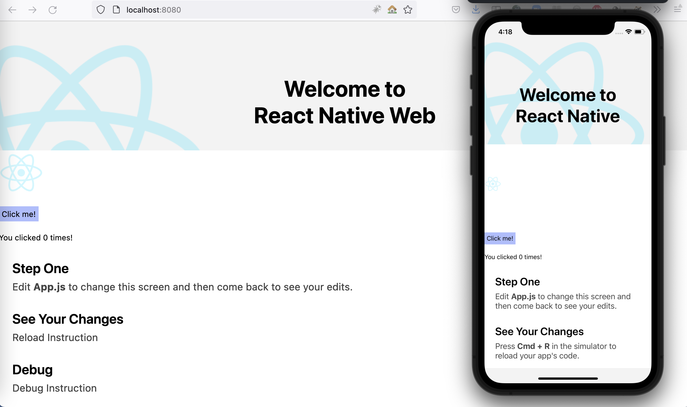

# webTest

This is a basic working example with images and some components to illustrate how the react native init app can be transformed with the help of react-native-web library. 

It does include Colors and Header but not DebugInstructions, LearnMoreLinks and ReloadInstructions from react-native/Libraries/NewAppScreen components.

The example created in a MacBook Pro M1 with macOS 11.6

## Clone
git clone https://github.com/vdalakas/webTest.git
## Change dir
cd webTest
## Install node modules
npm install
## Launch build script for webpack server in production mode
npm run build-react
## Launch build script for webpack server in dev mode
npm run start-react
## Test it on web!
http://localhost:8080
## Test it on simulator
npx react-native run-ios or npx react-native run-android

